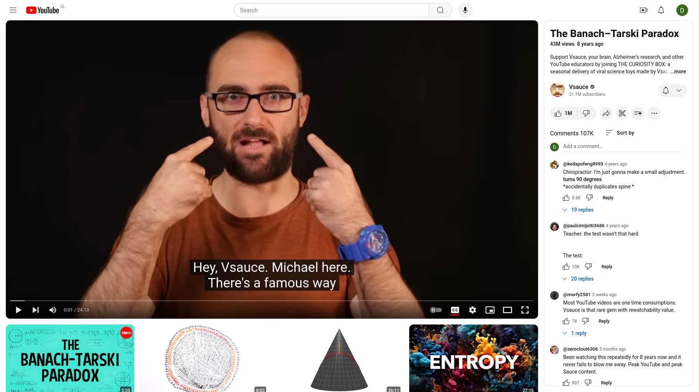

# uitube
A Firefox extension to make Youtube's new UI slightly more bearable. 

## Install

uitube can be installed from [Mozilla Add-ons for Firefox](https://addons.mozilla.org/en-US/firefox/addon/uitube/).

## Before:

Youtube's UI showing huge recommendation thumbnails while you're trying to watch a video:

## After:

Recommendations are not visible unless you scroll down.

